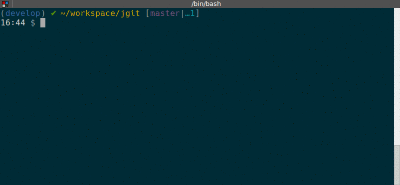

# GitQuery <a href="https://travis-ci.org/src-d/gitquery"></a> <a href="https://codecov.io/gh/src-d/gitquery"></a> <a href="https://godoc.org/gopkg.in/src-d/gitquery.v0"></a>

<div style="text-align:center"></div>

## Installation

Check the [Releases](https://github.com/src-d/gitquery/releases) page to download
the gitquery binary.

## Usage

```bash
Usage:
  gitquery [OPTIONS] <server | version>

Help Options:
  -h, --help  Show this help message

Available commands:
  server   Start SQL server.
  version  Show the version information.
```

A MySQL client is needed to connect to the server. For example:

```bash
$ mysql -u root -h 127.0.0.1
MySQL [(none)]> SELECT hash, author_email, author_name FROM commits LIMIT 2;
SELECT hash, author_email, author_name FROM commits LIMIT 2;
+------------------------------------------+---------------------+-----------------------+
| hash                                     | author_email        | author_name           |
+------------------------------------------+---------------------+-----------------------+
| 003dc36e0067b25333cb5d3a5ccc31fd028a1c83 | user1@test.io       | Santiago M. Mola      |
| 01ace9e4d144aaeb50eb630fed993375609bcf55 | user2@test.io       | Antonio Navarro Perez |
+------------------------------------------+---------------------+-----------------------+
2 rows in set (0.01 sec)
```

## Tables

gitquery exposes the following tables:

|     Name     |                                               Columns                                               |
|:------------:|:---------------------------------------------------------------------------------------------------:|
|    commits   | hash, author_name, author_email, author_time, comitter_name, comitter_email, comitter_time, message |
|     blobs    | hash, size                                                                                          |
|  refs        | name, type, hash, target, is_branch, is_note, is_remote, is_tag                                     |
|     tags     | hash, name, tagger_email, tagger_name, tagger_when, message, target                                 |
| tree_entries | tree_hash, entry_hash, mode, name                                                                   |

## SQL syntax

We are continuously adding more functionality to gitquery. We support a subset of the SQL standard, currently including:

|                        |                                     Supported                                     |
|:----------------------:|:---------------------------------------------------------------------------------:|
| Comparison expressions |                                !=, ==, >, <, >=,<=                                |
|  Grouping expressions  |                                    COUNT, FIRST                                   |
|  Standard expressions  |                              ALIAS, LITERAL, STAR (*)                             |
|       Statements       | CROSS JOIN, DESCRIBE, FILTER (WHERE), GROUP BY, LIMIT, SELECT, SHOW TABLES, SORT  |

## License

gitquery is licensed under the [MIT License](/LICENSE).
